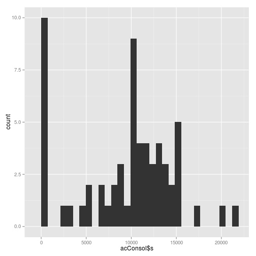
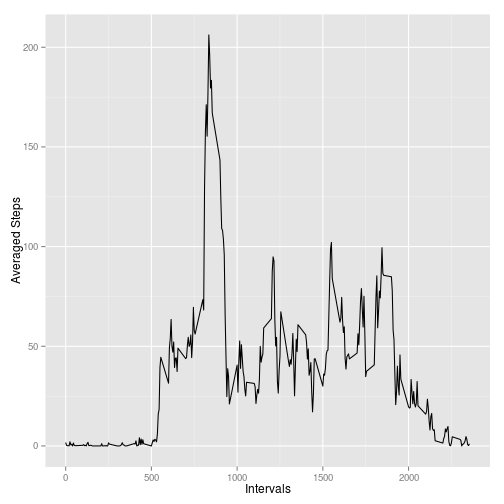
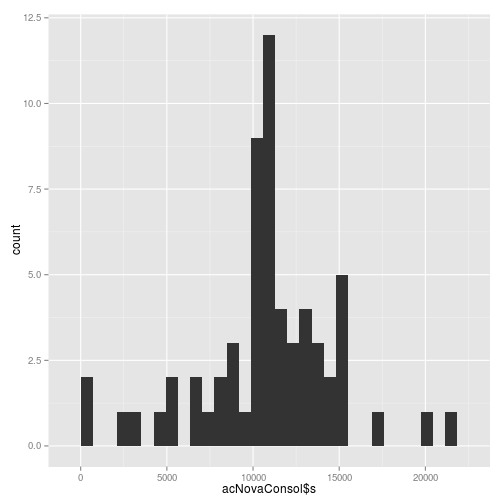
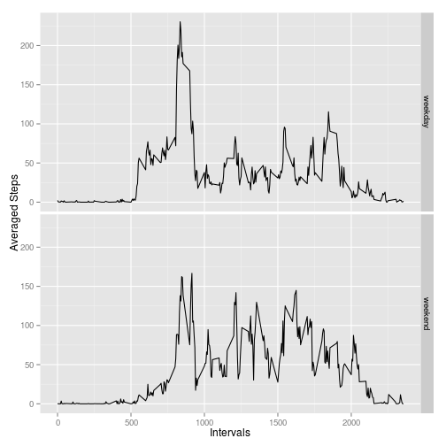
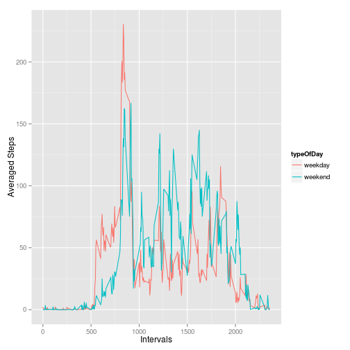

# Reproducible Research: Peer Assessment 1
  
  
## Loading and preprocessing the data

```r
library(dplyr)
library(ggplot2)
ac <- read.csv("activity.csv")
ac<-mutate(ac, date=as.Date(date))
```
  
## What is mean total number of steps taken per day?
  
Data aggregation:
  

```r
ac.grouped_date <- group_by(ac,date)
acConsol <- summarise(ac.grouped_date, s = sum(steps, na.rm=TRUE))
```
  
Histogram of the total number of steps taken each day:
  

```r
qplot(acConsol$s)
```

```
## stat_bin: binwidth defaulted to range/30. Use 'binwidth = x' to adjust this.
```

 
  
Mean and median calculation:
  

```r
meanStep <- mean(acConsol$s)
medianStep <- median(acConsol$s)
```
  
**Mean total number of steps taken per day: 9354.2295082**
  
**Median total number of steps taken per day: 10395**
  
  
  
## What is the average daily activity pattern?
  
Data preparation:
  

```r
ac.grouped_interval <- group_by(ac,interval)
acConsolInterval <- summarise(ac.grouped_interval, m = mean(steps, na.rm=TRUE))
```
  
Time series plot of the 5-minute interval (x-axis) and the average number of steps taken, averaged across all days (y-axis):
  

```r
qplot(interval, m, data = acConsolInterval, geom = "line") + labs(x="Intervals", y="Averaged Steps")
```

 
  
Calculation of the maximum average number os steps taken and the interval with the maximum average number os steps taken:
  

```r
maxAvgStep <- acConsolInterval[order(acConsolInterval$m, decreasing = TRUE),][1,]$m
maxAvgStepInterval <- acConsolInterval[order(acConsolInterval$m, decreasing = TRUE),][1,]$interval
```
  
**Maximum average number os steps taken: 206.1698113**
  
**Interval with the maximum average number os steps taken: 835**
  
  
  
## Imputing missing values
  
Data preparation:
  

```r
contaNA <- length(ac[is.na(ac$steps),1])
acNova <- ac
acNova$isNA <- is.na(ac$steps)
acNova$Mean <- ave(acNova$steps,acNova$interval,FUN = function(x) mean(x, na.rm = TRUE))
acNova$stepsMod <- ifelse(acNova$isNA, acNova$Mean, acNova$steps)
```
  
**The total number of missing values is: 2304**
  
**The missing values are concentrated on few days. On those days all values are missing. Therefore we have choosen to replace the missing values at each interval with the mean for that 5-minute interval.**
  
Data aggregation:
  

```r
acNova.grouped_date <- group_by(acNova,date)
acNovaConsol <- summarise(acNova.grouped_date, s = sum(stepsMod, na.rm=TRUE))
```
  
Histogram of the total number of steps taken each day:
  

```r
qplot(acNovaConsol$s)
```

```
## stat_bin: binwidth defaulted to range/30. Use 'binwidth = x' to adjust this.
```

 
  
Mean and median calculation:
  

```r
meanStep <- mean(acNovaConsol$s)
medianStep <- median(acNovaConsol$s)
```
  
**Mean total number of steps taken per day: 1.0766189 &times; 10<sup>4</sup>**
  
**Median total number of steps taken per day: 1.0766189 &times; 10<sup>4</sup>**
  
  
### Do these values differ from the estimates from the first part of the assignment? What is the impact of imputing missing data on the estimates of the total daily number of steps?  
    
**Yes, they differ. As the imputing data considered de interval of the day and not the date itself, when calculation the mean and the median values by day, it caused a difference in the results.**
    
  
  
## Are there differences in activity patterns between weekdays and weekends?
  
Creation of a new factor variable in the dataset with two levels -- "weekday" and "weekend" indicating whether a given date is a weekday or weekend day.
  

```r
acNova$DOW <- as.POSIXlt(acNova$date)$wday
acNova$typeOfDay <- factor(ifelse(acNova$DOW %in% c(0,6), "weekend", "weekday"))
```
  
Data preparation:
  

```r
acNova.grouped_interval <- group_by(acNova,interval,typeOfDay)
acNovaConsolInterval <- summarise(acNova.grouped_interval, m = mean(stepsMod))
```
  
Time series plot of the 5-minute interval (x-axis) and the average number of steps taken, averaged across all days (y-axis):
  
### First plot:

```r
qplot(interval, m, data = acNovaConsolInterval, geom = "line", facets = typeOfDay ~ .) + labs(x="Intervals", y="Averaged Steps")
```

 
  
### Second plot:

```r
qplot(interval, m, data = acNovaConsolInterval, geom = "line", col = typeOfDay) + labs(x="Intervals", y="Averaged Steps")
```

 
  
**Yes, there are differences in activity patterns between weekdays and weekends, as seen on the plots.**

